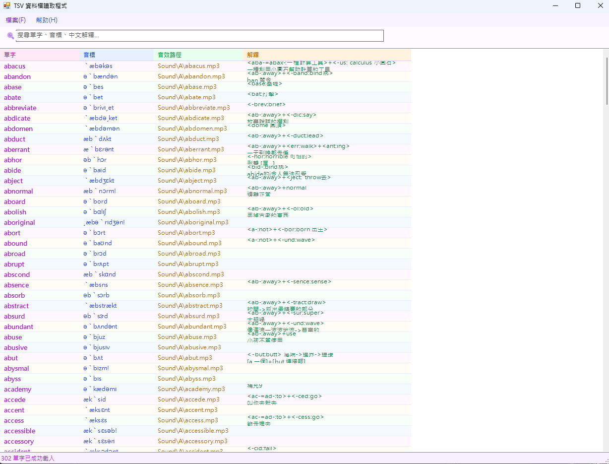

# TSV 資料檔讀取程式
視窗程式設計 (II) 上課練習

## 功能介紹

* 開啟並讀取 TSV 格式的單字檔案
* 以詳細資料檢視顯示單字、音標、音效路徑與中文解釋四欄資訊
* 即時搜尋列，可依單字、音標或中文解釋篩選單字
* 底部狀態列即時顯示載入總數與搜尋結果筆數
* 關閉視窗時彈出確認對話框，防止誤關

## 使用方式

1. 啟動程式後，點選上方「檔案」→「開啟檔案」載入檔案
2. 單字清單會依序顯示所有單字資料
3. 在搜尋列輸入關鍵字即可即時篩選單字、音標或中文解釋
4. 清除搜尋欄內容可恢復顯示全部單字
5. 點選「幫助」→「關於」查看程式資訊

## 執行畫面

## 開發環境

* C#
* Windows Forms (.NET Framework)
* Visual Studio

## 備註

* 支援 UTF-8 編碼的 TSV 檔案（副檔名 `.tsv` 或 `.txt`）
* 搜尋篩選不區分大小寫
* 狀態列會顯示「找到 X / Y 筆」方便確認篩選結果
